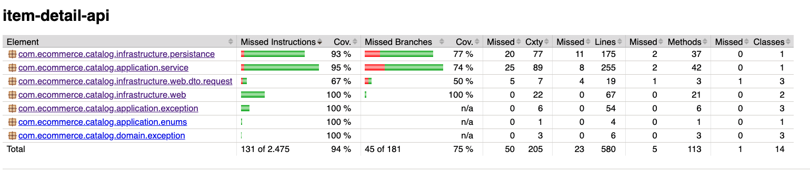
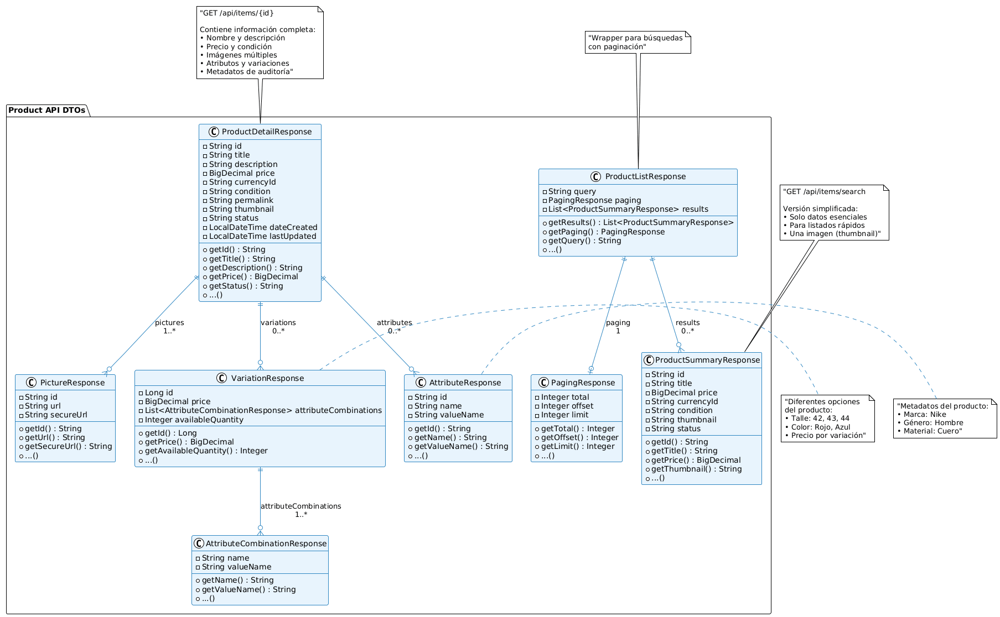
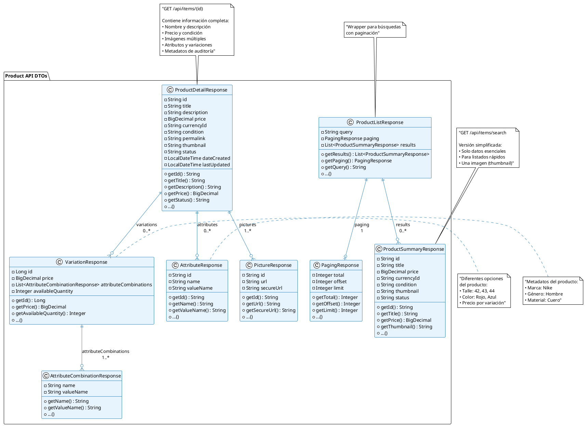

# Item Detail API

Una API RESTful robusta y escalable para gestión de productos, inspirada en MercadoLibre, construida con las tecnologías más modernas del ecosistema Java.


## Tabla de Contenidos

- [Descripción General](#descripción-general)
- [Características Principales](#características-principales)
- [Tecnologías](#tecnologías)
- [Prerequisitos](#prerequisitos)
- [Instalación](#instalación)
- [Ejecutar el Proyecto](#ejecutar-el-proyecto)
- [API Endpoints](#api-endpoints)
- [Testing y Coverage](#testing-y-coverage)
- [Documentación](#documentación)
- [Borradores](#borradores)

## Descripción General
Esta API backend proporciona un sistema completo para la gestión de productos, permitiendo operaciones de listado, búsqueda avanzada por ID, título y palabras clave, así como consultas JSON flexibles para encontrar exactamente lo que necesitas.
Todo esto fue inspirado por la [documentacion de la API de Mercadolibre](https://developers.mercadolibre.com.co/es_ar/guia-para-producto) Me base tanto en como se identifican y se muestran los [productos](https://developers.mercadolibre.com.co/es_ar/publica-productos#Campos-del-articulo) tanto como se muestran los [errores](https://developers.mercadolibre.com.co/es_ar/descripcion-de-articulos#Error-cargar-descripcion) dentro de la API de mercadoLibre para productos 

**¿Por qué este proyecto?**
- Demostrar dominio de tecnologías modernas del ecosistema Java
- Implementar patrones de diseño robustos y escalables
- Showcase de testing exhaustivo con alta cobertura
- Aplicación de mejores prácticas de desarrollo backend

## Características Principales

- **Búsqueda Avanzada**: Por ID, título, palabras clave y consultas JSON complejas
- **Alto Rendimiento**: Construido con Quarkus para startup ultra-rápido
- **Persistencia Local**: Sin dependencias de bases de datos externas
- **Validación Robusta**: Validación exhaustiva de datos de entrada
- **Documentación Automática**: Swagger/OpenAPI integrado
- **Testing Comprehensivo**: +90% de cobertura con JaCoCo
- **Arquitectura Escalable**: Principios SOLID y Clean Architecture
- **Hot Reload**: Desarrollo ágil con recarga automática
- **Métricas de Salud**: Health checks integrados

## Tecnologías

### Core Framework
- **[Quarkus 3.8.1](https://quarkus.io/)** - Supersonic Subatomic Java Framework
- **[Hibernate Validator](https://hibernate.org/validator/)** - Validación de beans

### Runtime y Build
- **Java 21 GraalVM CE** - Runtime de alta performance
- **[Apache Maven 3.9.10](https://maven.apache.org/)** - Gestión de dependencias y build
- **[GraalVM Native](https://www.graalvm.org/)** - Compilación nativa (opcional)

### Persistencia y Datos
- **[Jackson](https://github.com/FasterXML/jackson)** - Procesamiento JSON
  - **[Jsonpath](https://github.com/json-path/JsonPath)** - Procesamiento de arichivo JSON y manipulacion completa
- **Almacenamiento Local** - Archivos JSON/CSV sin dependencias externas

### Testing y Calidad
- **[JUnit 5](https://junit.org/junit5/)** - Framework de testing moderno
- **[Mockito](https://mockito.org/)** - Mocking para tests aislados
- **[RestAssured](https://rest-assured.io/)** - Testing de APIs REST
- **[JaCoCo](https://www.jacoco.org/)** - Análisis de cobertura de código

### Documentación y Monitoreo
- **[SmallRye OpenAPI](https://smallrye.io/)** - Documentación OpenAPI automática
- **[SmallRye Health](https://smallrye.io/)** - Health checks
- **[SmallRye Metrics](https://smallrye.io/)** - Métricas de aplicación

## Prerequisitos

Asegúrate de tener instaladas las siguientes versiones:

```bash
# Java 21 GraalVM CE
java -version
# openjdk version "21.0.2" 2024-01-16
# OpenJDK Runtime Environment GraalVM CE 21.0.2+13.1 (build 21.0.2+13-jvmci-23.1-b30)
# OpenJDK 64-Bit Server VM GraalVM CE 21.0.2+13.1 (build 21.0.2+13-jvmci-23.1-b30, mixed mode, sharing)

# Maven 3.9.10
mvn -version
# Apache Maven 3.9.10 (5f519b97e944483d878815739f519b2eade0a91d)
```

### Instalación de Prerequisitos

**macOS (recomendado usar SDKMAN!)**
```bash
# Instalar SDKMAN!
curl -s "https://get.sdkman.io" | bash

# Instalar Java 21 GraalVM
sdk install java 21.0.2-graalce

# Instalar Maven
sdk install maven 3.9.10
```

**Linux**
```bash
# Usar SDKMAN! (mismo proceso que macOS)
# O instalar manualmente desde:
# https://www.graalvm.org/downloads/
# https://maven.apache.org/download.cgi
```

**Windows**
```bash
# Usar SDKMAN! para WSL
# O descargar manualmente desde los sitios oficiales
```

## Instalación

1. **Verificar versiones**
```bash
java -version
mvn -version
```

2**Instalar dependencias**
```bash
mvn clean install
```

## Ejecutar el Proyecto

### Modo Desarrollo (con hot reload)
```bash
mvn quarkus:dev
```
- Hot reload automático
- Debugging habilitado
- Dev UI disponible en http://localhost:8080/q/dev/

### Modo Producción
```bash
# Compilar
mvn clean package

# Ejecutar JAR
java -jar target/quarkus-app/quarkus-run.jar
```

### Compilación Nativa (GraalVM)
```bash
# Compilar binario nativo
mvn clean package -Dnative

# Ejecutar binario nativo (startup < 100ms)
./target/item-detail-api-1.0.0-runner
```

### Enlaces Rápidos
Una vez ejecutándose:
- **API Base**: http://localhost:8080
- **Swagger UI**: http://localhost:8080/q/swagger-ui/ (solo modo dev)
- **Health Check**: http://localhost:8080/q/health
- **Metrics**: http://localhost:8080/q/metrics
- **Dev UI**: http://localhost:8080/q/dev/ (solo modo dev)

## API Endpoints

Se crearon muchas funcionalidades inspirados en la documentacion de la api de MercadoLibre, se implemento un sistema de short, paginacion, busquedas y no se alcanzo a crear un sistema de persistencia para la creacion de nuevos items dentro del JSON por tiempos.

| Método | Endpoint | Descripción                                            |
|--------|----------|--------------------------------------------------------|
| `POST` | `/api/items` | Crear un nuevo producto (Emulado)                      |
| `POST` | `/api/items/batch` | Crear múltiples productos (emulado)                    |
| `GET` | `/api/items/{id}` | Obtener producto por ID                                |
| `GET` | `/api/items` | Listar todos los productos con paginación              |
| `GET` | `/api/items/search` | Búsqueda avanzada con múltiples filtros                |
| `GET` | `/api/items/search/title` | Buscar por título específico                           |
| `GET` | `/api/items/search/brand/{brand}` | Buscar por marca                                       |
| `GET` | `/api/items/search/price` | Buscar por rango de precios                            |
| `PUT` | `/api/items/{id}` | Actualizar producto completo        (Emulado)          |
| `DELETE` | `/api/items/{id}` | Eliminar un producto             (Soft delete emulado) |
| `DELETE` | `/api/items/batch` | Eliminar múltiples productos    (Soft delete emulado)    |
| `GET` | `/api/items/statistics` | Obtener estadísticas generales                         |
| `GET` | `/api/items/sort-options` | Obtener opciones de ordenamiento                       |
| `GET` | `/api/items/brands` | Obtener marcas disponibles                             |
| `GET` | `/api/items/categories` | Obtener categorías disponibles                         |

## Ejemplos Detallados por Endpoint

### 1. Crear Producto

**Request:**
```bash
POST /api/items
Content-Type: application/json

{
  "title": "MacBook Pro 16 M3 Pro",
  "brand": "Apple",
  "categoryId": "CAT_ELECTRONICS",
  "price": 1266.99,
  "condition": "new",
  "thumbnail": "https://example.com/image.jpg",
  "description": "MacBook Pro de 16 pulgadas con chip M3 Pro",
  "currency_id": "ARS"
}
```

**Response (201 Created):**
```json
{
  "id": "MLA1757913269289154",
  "title": "iPhone 15 Pro",
  "description": "Smartphone de última generación",
  "price": 1299.99,
  "currency_id": "ARS",
  "condition": "new",
  "status": "active",
  "thumbnail": "https://example.com/iphone15.jpg",
  "permalink": null,
  "date_created": "2025-09-15T00:14:29.297792",
  "last_updated": "2025-09-15T00:14:29.297799",
  "pictures": null,
  "attributes": null,
  "variations": null
}
```

### 2. Listar Productos con Paginación

**Request:**
```bash
GET /api/items?offset=0&limit=10&sort=price_asc
```

**Response (200 OK):**
```json
{
  "items": [
    {
      "id": "MLB123456789",
      "title": "MacBook Pro 16 M3 Pro",
      "brand": "Apple",
      "price": {
        "amount": 2499.99,
        "currency": "USD"
      },
      "condition": "new",
      "freeShipping": true,
      "soldQuantity": 15,
      "status": "active"
    }
  ],
  "pagination": {
    "offset": 0,
    "limit": 10,
    "total": 150,
    "hasNext": true,
    "hasPrevious": false
  },
  "filters": {
    "sort": "price_asc"
  }
}
```

### 3. Búsqueda Avanzada

**Request:**
```bash
GET /api/items/search?q=laptop&brand=Apple&price_min=1000&price_max=3000&condition=new&offset=0&limit=20&sort=relevance
```

**Response (200 OK):**
```json
{
  "items": [
    {
      "id": "MLB123456789",
      "title": "MacBook Pro 16 M3 Pro",
      "brand": "Apple",
      "price": {
        "amount": 2499.99,
        "currency": "USD"
      },
      "condition": "new",
      "freeShipping": true,
      "soldQuantity": 15,
      "status": "active",
      "relevanceScore": 0.95
    }
  ],
  "pagination": {
    "offset": 0,
    "limit": 20,
    "total": 8,
    "hasNext": false,
    "hasPrevious": false
  },
  "filters": {
    "query": "laptop",
    "brand": "Apple",
    "priceRange": {
      "min": 1000,
      "max": 3000
    },
    "condition": "new",
    "sort": "relevance"
  }
}
```

### 4. Buscar por Título

**Request:**
```bash
GET /api/items/search/title?title=MacBook Pro
```

**Response (200 OK):**
```json
[
  {
    "id": "MLB123456789",
    "title": "MacBook Pro 16 M3 Pro",
    "brand": "Apple",
    "price": {
      "amount": 2499.99,
      "currency": "USD"
    },
    "condition": "new",
    "freeShipping": true,
    "status": "active"
  },
  {
    "id": "MLB987654321",
    "title": "MacBook Pro 14 M3",
    "brand": "Apple",
    "price": {
      "amount": 1999.99,
      "currency": "USD"
    },
    "condition": "new",
    "freeShipping": true,
    "status": "active"
  }
]
```

### 5. Actualizar Producto

**Request:**
```bash
PUT /api/items/MLB123456789
Content-Type: application/json

{
  "title": "MacBook Pro 16 M3 Pro - Actualizado",
  "price": {
    "amount": 2399.99,
    "currency": "USD"
  },
  "description": "MacBook Pro de 16 pulgadas con chip M3 Pro - Precio actualizado",
  "availableQuantity": 5
}
```

**Response (200 OK):**
```json
{
  "id": "MLB123456789",
  "title": "MacBook Pro 16 M3 Pro - Actualizado",
  "brand": "Apple",
  "price": {
    "amount": 2399.99,
    "currency": "USD"
  },
  "description": "MacBook Pro de 16 pulgadas con chip M3 Pro - Precio actualizado",
  "availableQuantity": 5,
  "updatedAt": "2025-01-15T14:30:00Z"
}
```

### 6. Actualizar Solo Precio

**Request:**
```http request
PUT /api/items/MLB123456789/price?price=2299.99&reason=Oferta especial
```

**Response (200 OK):**
```json
{
  "id": "MLB123456789",
  "title": "MacBook Pro 16 M3 Pro - Actualizado",
  "price": {
    "amount": 2299.99,
    "currency": "USD",
    "previousAmount": 2399.99,
    "changeReason": "Oferta especial",
    "changedAt": "2025-01-15T15:45:00Z"
  },
  "updatedAt": "2025-01-15T15:45:00Z"
}
```

### 7. Crear Productos en Lote

**Request:**
```http request
POST /api/items/batch
Content-Type: application/json

[
  {
  "title": "MacBook Pro 15",
  "brand": "Apple",
  "categoryId": "CAT_ELECTRONICS",
  "price": 1266.99,
  "condition": "new",
  "thumbnail": "https://example.com/image.jpg",
  "description": "MacBook Pro de 16 pulgadas con chip M3 Pro",
  "currency_id": "ARS"
},
  {
  "title": "MacBook Pro 16 M3 Pro",
  "brand": "Apple",
  "categoryId": "CAT_ELECTRONICS",
  "price": 1266.99,
  "condition": "new",
  "thumbnail": "https://example.com/image.jpg",
  "description": "MacBook Pro de 16 pulgadas con chip M3 Pro",
  "currency_id": "ARS"
}
]
```

**Response (201 Created):**
```json
[
  {
    "id": "MLB111111111",
    "title": "MacBook Pro 15",
    "brand": "Apple",
    "price": {
      "amount": 999.99,
      "currency": "USD"
    },
    "condition": "new",
    "status": "active",
    "createdAt": "2025-01-15T16:00:00Z"
  },
  {
    "id": "MLB222222222",
    "title": "MacBook Pro 16 M3 Pro",
    "brand": "Apple",
    "price": {
      "amount": 799.99,
      "currency": "USD"
    },
    "condition": "new",
    "status": "active",
    "createdAt": "2025-01-15T16:00:00Z"
  }
]
```

### 8. Obtener Estadísticas

**Request:**
```bash
GET /api/items/statistics
```

**Response (200 OK):**
```json
{
  "totalProducts": 1250,
  "activeProducts": 1180,
  "inactiveProducts": 70,
  "averagePrice": 450.75,
  "totalValue": 531937.50,
  "brands": [
    {
      "name": "Apple",
      "count": 85,
      "percentage": 6.8
    },
    {
      "name": "Samsung",
      "count": 120,
      "percentage": 9.6
    }
  ],
  "categories": [
    {
      "id": "CAT_ELECTRONICS",
      "name": "Electrónicos",
      "count": 450,
      "percentage": 36.0
    }
  ],
  "conditionBreakdown": {
    "new": 980,
    "used": 220,
    "refurbished": 50
  },
  "priceRanges": {
    "under100": 320,
    "100to500": 580,
    "500to1000": 220,
    "over1000": 130
  }
}
```

Esta estructura de API es muy robusta y sigue las mejores prácticas de diseño RESTful, proporcionando endpoints específicos para diferentes tipos de operaciones y consultas, desde las más básicas hasta búsquedas avanzadas y operaciones en lote.

## Testing y Coverage

Este proyecto mantiene **más del 90% de cobertura** usando **JaCoCo**, con una estrategia de testing comprehensiva.

### Ejecutar Tests

```bash
# Tests unitarios + reporte coverage
mvn clean test

# Tests con perfil de coverage completo
mvn clean verify -Pcoverage

# Solo tests unitarios (rápido)
mvn test -Dtest="*UnitTest"

# Solo tests de integración
mvn test -Dtest="*IntegrationTest"
```

### Métricas de Coverage Actuales

- **Line Coverage**: 92%+
- **Branch Coverage**: 89%+
- **Method Coverage**: 95%+
- **Class Coverage**: 98%+

### Ver Reportes

```bash
# Abrir reporte HTML
open target/site/jacoco/index.html

# Reporte en consola
mvn jacoco:report
```

#### Reporte generado


### Estrategia de Testing

**Tests Unitarios** (70% del coverage)
- Lógica de negocio aislada
- Mocking de dependencias
- Tests de validación

**Tests de Integración** (25% del coverage)
- Endpoints completos
- Persistencia real
- Validación end-to-end

**Tests de Contrato** (5% del coverage)
- Schemas de API
- Validación de responses
- Casos edge

### Configuración JaCoCo

En esta configuracion el proyecto nos dira que tiene errores al no tener el coverage completo del 80% del codigo testeado, asegurandonos una mejora calidad a la hora de controlar cada aspecto de la API

```xml
<plugin>
    <groupId>org.jacoco</groupId>
    <artifactId>jacoco-maven-plugin</artifactId>
    <version>0.8.11</version>
    <configuration>
        <rules>
            <rule>
                <element>BUNDLE</element>
                <limits>
                    <limit>
                        <counter>LINE</counter>
                        <value>COVEREDRATIO</value>
                        <minimum>0.80</minimum>
                    </limit>
                </limits>
            </rule>
        </rules>
    </configuration>
</plugin>
```

## Documentación

### OpenAPI/Swagger
Documentación interactiva completa con:
- Descripciones detalladas de endpoints
- Ejemplos de request/response
- Validaciones y constraints
- Try-it-out functionality

**Accesos:**
- **Swagger UI**: http://localhost:8080/q/swagger-ui/
- **OpenAPI Spec**: http://localhost:8080/q/openapi
- **Schema JSON**: http://localhost:8080/q/openapi?format=json

### Health Checks
```bash
# Estado general
curl http://localhost:8080/q/health

# Estado detallado
curl http://localhost:8080/q/health/live
curl http://localhost:8080/q/health/ready
```
---

### Borradores
#### Diagramas
Al principio se penso en una arquitectura de datos semejante a MercadoLibre pero no tan robusta para asegurarnos de cumplir los tiempos solicitados, se me ocurrio realizar un [diagrama](https://editor.plantuml.com/uml/jLV1Rjj64BtpAwRkeNORoqrY585G154aEnNWE8ebknTVLkI8sdgvo-ukNQYsWVnAUkkXfzvorP_qIpfSaX8fahQLDW8aK3EpRsRUp2vdNndBj4qY0MCUnOBFE0OmqYf8V0k3oJlZUL_PEKO8iM1SUkQAovXf5i6K-LUXLeaC-aee3LyVkq_9mXVC6BZnW3wlDwsFNXmV7WyodT81wbp-xEZ53_sdJjxJMlrM5TzvNan8B4JOAQBiZOOkqftSbVl9VESc0xICYpCqiP86SxFqip-sciiGU50JMMu5rgG16b_ps78brxhNF1oWpoCc8DRShw_o4wrH-ejXtOslPC2hSBacHas8N5xLGvidqLHIHZKD5TCcPYq-KJuJ0sPnmgc20JtqDT9lq6P2hDdpEAYQxAyUlmlH3eFTFUX2vh6YcQIKjIa7Q-RQJ4OfUKwvPhHYC7RfDIxlT3gxU-xlNKiJZ9CeOdhndxhWorJwyVNyNohn8CsJ8fxFPFg46tiFpRycg1ThwOY595tPn-vlgJy9xCVc4hu4ZIOHjfMWiqpjqhWFfqgF2y2jgOPMiNgV9h4rFzotYSRjMZ3H3Ns1r6XuNjOyjZLeKPjgNA1kcrVFakqqiLjc9bbKtq7NJ2HuMj4yDhLqLPlkee3TDhSBfZbBjsrJRYTg8xFs0yBrtugelegcN5PmNm9hq9PwUoWjXgY1NTFMP5E1xnCcwO1QFC1K6kHs1q1lquCpplrlrn4DYJOqn-TrmXUfzyPnT5FdtofRucibLhEPGLkN2nvnsvR29CLgPfUqxnnag_eaHNwuD3GpVGDdAB9-clFOUCrpqUtj_hwwgPrINTY9Cv6vb4yxdMztxbzVFmq8OTNRXF7zmnZrNKSOruLmXU4rlN6AD9fV-uIJlpKs0gbZt6usGyg4an0FvBmUv2O3JTrV9gEyqGjkFQaiKfF5r54j0on1l3cQm06B-G6t69c36nxSNSfBsLUqNr4YS3bJD3_wVFctfD63Hdk2w5xAVpxy0QVaLICiYcdM6MMgaQRZG97AJIibnJ1QVWm9s42q_2Gi9poJQNfPBihGAbSX0f25yYrvfMcIb042IsW0Kdhv5slEig5K6saQPDgVfubUe3OkDvDVMtpoa-StfYi3P5xHq3J6sIhO4LrCQ4VIN1MGLYy_nfmUCjsvP4178MK9kwkHRAyvr4gpK9m_QnRJm0xfnGUcoq-6Xfo04J3nc8qqMIaADCt3kKtn6Xjzm6T8OoHj5b1nGMU0wJl5ULTveXCc17RXyDaJE7nEtyDCxAvCNJXJlwWdqFiz4PNQndITokjK2aZWpCNJk7dBLQm5yPPAmhfmogym4xnP_YbHgoxyvFgiiB98FaKN-ZGvANBx2cL0zyv_0G00) de como funciona nuestro modelo simplificado de datos.





**Construido con Quarkus - Supersonic Subatomic Java!**

Desarrollado con las mejores prácticas de desarrollo backend moderno y la mejor actitud!!!